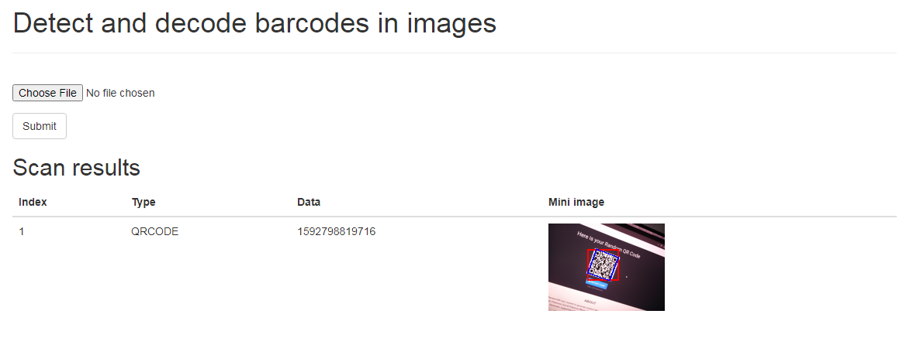
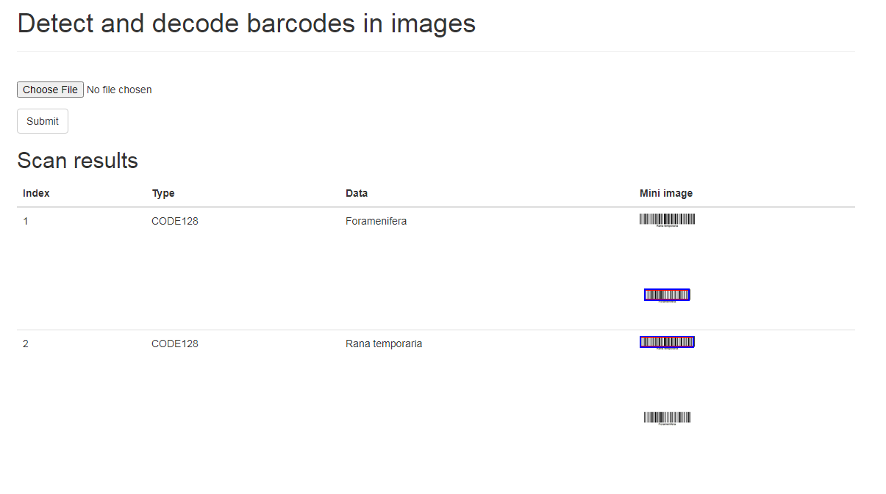

# Flask-qr-decode

Web application to decode barcodes in images via HTTP. Uses zbar as decoding backend.

## Build

```bash
cp .env-example .env
# Change passwords in .env
mkdir owncert
# Put your custom certificate and key from a valid CA to certificate.pem and
# key.pem. certificate.pem may contain concatenated chain of certificates. Site
# certificate must be followed by top level CA certificates.
```

Now open https://<your_domain>:5000/main in your browser, select image file in a form, sibmit it and you'll get scan results as below. Mini images will be shown with rectangles where every barcode was detected in the image.

## Examples



